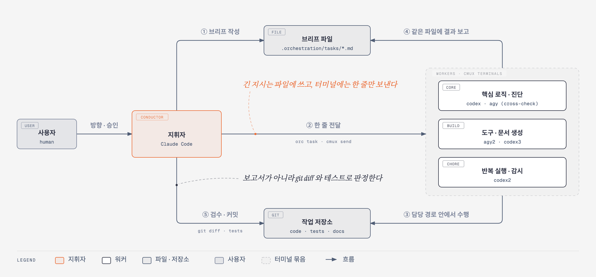

# AI Agent Orchestration

Claude Code 세션 하나가 지휘자가 되어, 옆 터미널에 띄운 CLI 에이전트 다섯(Codex 3, Antigravity 2)에게
일을 나눠 주고 결과를 검수한 방식과 그 기록이다.

상세페이지 생성 AI 프로젝트에서 2026-09-09 부터 2026-10-05 까지 27일 동안 썼다.
이 저장소에는 지휘 도구, 운영 규약, 활용 기록, 그리고 그동안 실제로 발행한 브리프 188건이 들어 있다.

<p align="center">
  
</p>

## 한눈에 보기

| 항목 | 값 |
| --- | --- |
| 지휘자 | Claude Code 세션 1개 (설계·브리프 작성·검수·커밋) |
| 워커 | Codex CLI 3개(`codex`, `codex2`, `codex3`), Antigravity CLI 2개(`agy`, `agy2`) |
| 실행 환경 | cmux 워크스페이스 하나에 터미널을 나눠 띄움 |
| 발행한 브리프 | 188건. 가장 많은 날은 하루 47건 (2026-09-10) |
| 교차검증 | 5회 (같은 브리프를 두 워커에 독립 발행) |
| 분할 검수 | 1회 (워커 지적 31건을 지휘자가 전부 재확인해 5건 기각) |
| 같은 기간 프로젝트 저장소 | 커밋 148개, PR 15건 |

수치의 집계 방법과 워커별 내역은 [활용 기록 7절](docs/orchestration-usage.md#7-수치)에 있다.

## 한 건이 흘러가는 순서

1. **브리프 작성** — 지휘자가 무엇을 고칠지와 합격 기준을 정해 파일 하나로 쓴다.
2. **한 줄 전달** — 워커 터미널에는 "그 파일을 읽고 수행하라"는 한 줄만 들어간다.
3. **수행** — 워커는 브리프에 적힌 담당 경로 안에서만 작업한다.
4. **결과 보고** — 워커가 같은 브리프 파일 하단에 `## 결과` 로 변경 파일·검증 방법·미해결 이슈를 적는다.
5. **검수·커밋** — 지휘자가 `git diff` 와 테스트로 직접 확인한 뒤 수용하거나 후속 브리프를 낸다.

긴 지시를 터미널에 바로 넣지 않는 이유는, CLI 프롬프트가 개행에서 바로 제출되어 지시가 중간에서
끊기기 때문이다.

## 쓰면서 굳은 규칙

| 규칙 | 이렇게 된 계기 |
| --- | --- |
| 합격 기준을 수치로 적고, 정답을 아는 검증 사례를 같이 준다 | 판정 도구가 "돌아는 가는데 틀린 답"을 내 재작업 3건이 났다 |
| 원인이 불확실한 진단은 두 워커에 독립으로 맡기고 서로의 결과를 못 보게 한다 | 두 워커의 강점이 겹치지 않아, 한쪽만 쓰면 그쪽의 사각이 결과가 됐다 |
| 워커의 보고와 지적은 코드·테스트·실제 상태로 확인한 뒤에만 채택한다 | 워커가 확인 없이 추정한 지적이 사실과 달랐다 |
| 모든 브리프에 git 상태 변경 금지를 넣는다 | 워커가 `git reset` 으로 커밋을 되돌렸다 |
| 동시에 쓰이는 파일을 브리프에 적어 준다 | 다른 워커의 폴더 재조직이 실행 중이던 작업 2건을 죽였다 |
| 지휘자는 설계·배분·검수만 한다 | 워커가 한도에 걸리자 지휘자가 구현을 떠안았다 |

전체 12건은 [활용 기록 9절](docs/orchestration-usage.md#9-겪은-문제와-바꾼-규칙)에 있다.

## 저장소 구성

```
scripts/orchestration/
├── orc                     지휘 도구 (list / send / task / wait / read / board)
└── workers.tsv             워커 등록표 (별칭·tty·종류·작업 중 판별 패턴·티어)
docs/
├── orchestration.md        운영 규약 — 역할, 티어 배정 근거, 교차검증 절차, 브리프 작성 규칙
├── orchestration-usage.md  활용 기록 — 무엇을 얼마나 어떻게 맡겼고, 쓰면서 무엇을 고쳤나
└── images/                 구성도 원본(HTML)·이미지(PNG)·생성 스크립트
records/                    실제 기록 사본 — 보드, 브리프 188건, 워커별 지시서, 제안서, 검수 보고서
```

## 기록에서 먼저 볼 것

| 사례 | 날짜 | 기록 |
| --- | --- | --- |
| 교차검증으로 원인 좁히기 | 09-10 | 같은 브리프 [`codex`](records/tasks/20260910-105816-codex.md) · [`agy`](records/tasks/20260910-105817-agy.md), 제안서 [`codex`](records/proposals/prompt-fixed-sequence-codex.md) · [`agy`](records/proposals/prompt-fixed-sequence-agy.md) |
| 분할 검수 | 09-16 | 지시서 [`audit-*.md`](records/briefs/), 최종 판정 [`00-final.md`](records/reports/audit-2026-09-16/00-final.md) |
| 안전성 검증 세 갈래 병렬 | 09-21 | [편향](records/tasks/20260921-160040-agy.md) · [Prompt Injection](records/tasks/20260921-160103-codex.md) · [환각](records/tasks/20260921-160159-agy2.md) |
| 반복 감시 | 09-09 | [브리프](records/tasks/20260909-212343-agy2.md), [사이클 기록](records/watch/status.md) |
| 실제 사이트 전체 흐름 테스트 | 10-01 | [브리프와 결과](records/tasks/20261001-ubuntu-e2e.md) |
| 수정을 PR·머지까지 위임 | 10-05 | [브리프와 결과](records/tasks/20261005-outbox-callback-pr.md) |
| 워커의 검수 결과도 검증 | 10-05 | [브리프와 결과](records/tasks/20261005-genai-readme-review.md) |
| 다른 팀에 줄 수정안 작성 | 10-01 | [브리프와 결과](records/tasks/20261001-chatbot-llm-oom.md) |

사례별 설명은 [활용 기록 8절](docs/orchestration-usage.md#8-대표-사례)에, 기록에서 가린 값과 뺀 자료는
[`records/README.md`](records/README.md)에 있다.

## 도구 쓰는 법

`orc` 는 bash 스크립트 하나다. macOS 의 cmux 터미널에서 썼고, 워커 터미널을 찾고
글자를 넣고 화면을 읽는 일을 모두 cmux CLI 에 맡긴다. cmux 가 `/usr/local/bin/cmux` 가 아닌 곳에 있으면
`CMUX_BIN` 으로 경로를 준다.

```bash
# 1. 워커로 쓸 터미널의 tty 를 확인해 workers.tsv 에 등록한다
cmux tree --all

# 2. 워커 목록과 idle / busy 상태
scripts/orchestration/orc list

# 3. 브리프를 파일로 만들고 워커에게 한 줄로 전달한다
echo "tests/test_example.py 를 통과시키세요" | scripts/orchestration/orc task codex "example 테스트 수리"

# 4. 워커가 입력 대기로 돌아오면 화면을 읽는다
scripts/orchestration/orc wait codex 900 && scripts/orchestration/orc read codex 80
```

- 브리프와 보드는 저장소 루트의 `.orchestration/` 에 쌓이고, 이 폴더는 git 에 올리지 않는다.
- 스크립트는 자기 위치에서 두 단계 위를 저장소 루트로 본다. 다른 프로젝트에서 쓰려면
  `scripts/orchestration/` 폴더를 그대로 옮긴다.
- `workers.tsv` 에 들어 있는 tty 값은 기록 당시의 것이다. 터미널을 새로 띄우면 다시 확인해 고친다.

## 문서

| 문서 | 내용 |
| --- | --- |
| [`docs/orchestration.md`](docs/orchestration.md) | 운영 규약. 초기 36건을 측정해 워커를 티어로 나눈 근거가 여기 있다 |
| [`docs/orchestration-usage.md`](docs/orchestration-usage.md) | 활용 기록. 기간별 사용, 수치, 대표 사례 8건, 겪은 문제와 바꾼 규칙 |
| [`records/README.md`](records/README.md) | 기록 폴더 안내 |

구성도는 `python3 docs/images/generate.py docs/images` 로 HTML 을 다시 만들 수 있다.
